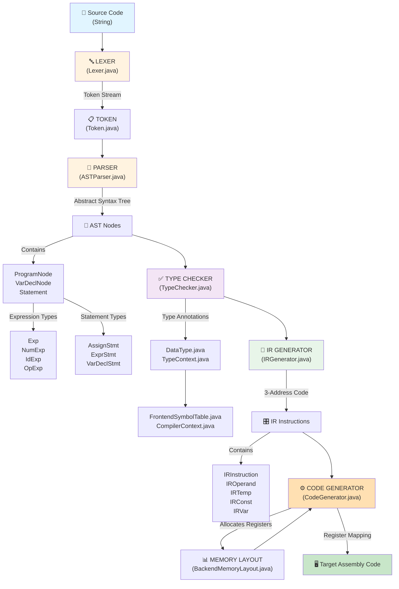

# Simple Calculator Compiler - Architecture Diagram

## Overview
This is a simple calculator compiler following a classic multi-phase compiler architecture: Lexical Analysis → Syntax Analysis → Semantic Analysis → Intermediate Code Generation → Code Generation.

## Architecture Diagram



## Detailed Component Breakdown

### **Phase 1: Lexical Analysis (Lexer)**
- **Lexer.java**: Tokenizes source code
- **Token.java**: Represents tokens (INT, ID, ASSIGN_OP, SEMI, etc.)
- **Output**: Stream of tokens with values

### **Phase 2: Syntax Analysis (Parser)**
- **ASTParser.java**: Recursive descent parser
- **ProgramNode.java**: Root AST node containing statements
- **Statement.java**: Base class for statements
- **Exp.java**: Base class for expressions
- **Output**: Abstract Syntax Tree (AST)

### **Phase 3: Semantic Analysis (Type Checker)**
- **TypeChecker.java**: Visitor pattern implementation for type checking
- **DataType.java**: Type enumeration (INT, STRING, etc.)
- **TypeContext.java**: Type checking context
- **CompilerContext.java**: Unified compiler context
- **FrontendSymbolTable.java**: Symbol table for variable declarations
- **Output**: Type-annotated AST

### **Phase 4: Intermediate Code Generation**
- **IRGenerator.java**: Converts AST to 3-Address Code (3AC)
- **IRInstruction.java**: Represents individual IR instructions
- **IROperand.java**: Base class for operands
- **IRConst.java**: Constant operand
- **IRVar.java**: Variable operand
- **IRTemp.java**: Temporary register operand
- **Output**: Flat list of IR instructions

### **Phase 5: Code Generation (Backend)**
- **CodeGenerator.java**: Converts IR to target assembly code
- **BackendMemoryLayout.java**: Memory allocation and frame management
- **AddressTable.java**: Tracks variable memory addresses
- **Output**: Target assembly code with register allocation

## Supporting Components

- **ASTVisitor.java**: Visitor interface for AST traversal
- **ASTPrinter.java**: AST debugging and printing utility
- **PrintContext.java**: Formatting context for output
- **VarID.java**: Variable identifier representation
- **Main.java**: Compiler entry point orchestrating all phases

## Compilation Flow

```
Source Code (String)
    ↓
[Lexer] → Token Stream
    ↓
[Parser] → AST (ProgramNode)
    ↓
[Type Checker] → Type-checked AST
    ↓
[IR Generator] → List<IRInstruction>
    ↓
[Code Generator] → Assembly Code
    ↓
Compiled Output
```

## Key Design Patterns

1. **Visitor Pattern**: Used in TypeChecker and potential ASTPrinter for tree traversal
2. **Context Pattern**: CompilerContext, TypeContext for maintaining state
3. **Symbol Table Pattern**: FrontendSymbolTable for variable tracking
4. **Three-Address Code**: IR representation for platform-independent intermediate code
